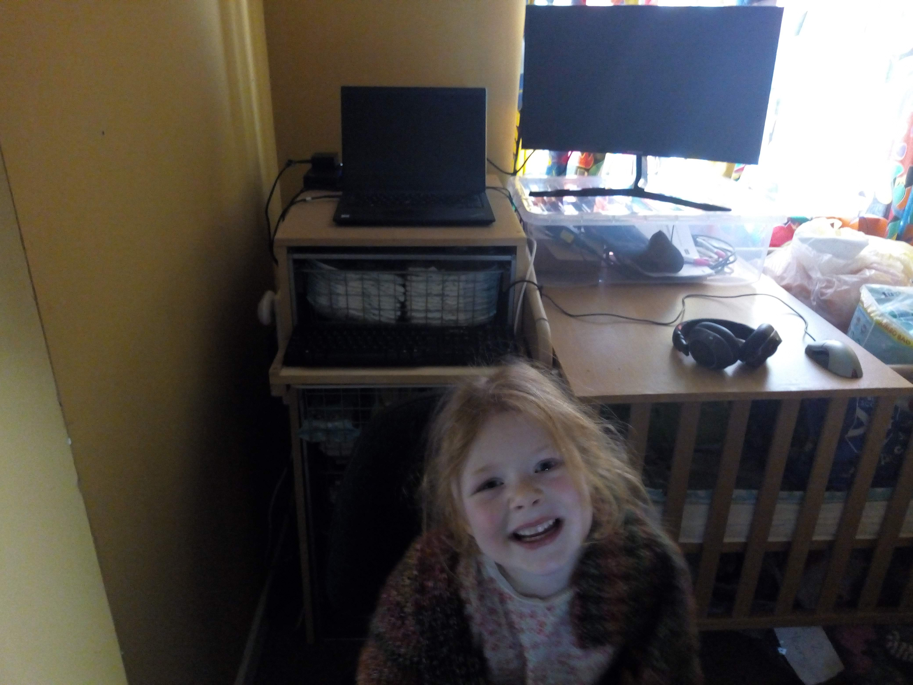

# Learning from a First Exploration of Workshop Remote Teaching

TL;DR

Bullet Points:

Background:
* Postgraduate+ workshops in reasearch software skills
* Primarily postgraduate research students, across University, STEM including HHS, Management
* [Version control](https://arc-lessons.github.io/version-control-git) && [Working with data](https://arc-lessons.github.io/intro-data-plotting)
* [Software Carpentry](https://software-carpentry.org) style courses
* These two of our courses have clear instructions, relatively few exercises

Aims:
* Aim to expand broader Research Software Skills programme
* PG+ Participants from all faculties in the University with an interest developing their Python/Data skills
* We want to improve digital-programming literacy enabling more efficient working and reproducible research
* Previously taught face-to-face workshops in computer workrooms with PG demo

Action + Impact:
* Delivered in Teams using a 'Class' team.
* Meeting in channel '<Course name>'
* Anyone in Team can join/choose to add to calendar
* Chat used for questions
* Simple polling using @forms
* This style of team has 'Class notebooks' including individual private notebooks for students to receive 1-2-1 support
* We managed to field all questions in chat via text/presenter.
* 15 minute 'Intro How are we gong to use teams'
* 10 minute 'How we advise students to follow' managing: teams-tutorial material-programming workspace
* Generally went well
* Gremlins first time out
  - students unable to join meeting: created new meeting in general channel
  - overheated ethernet port in laptop hub - switched to port on laptop
* Ran smoothly second time round
* Need to check that class notebooks works as a sharing platform for our needs went unused through both sessions

Reflections:
**The good:**
* Tried and tested material and pltform survived transition unchanged
* Teams stood up well
* Appropriate use of polls (we used @forms 'Polly' also been suggested for Teams) 
  - ready to move on
  - knowledge check

**The not so good**
* Difficult with little feedback from students
* Repeated the 'how we are going to use the platform' took time out, but did refine how we do things
* Demonstrators to have clearly assigned roles

**For next time**
* Make sustained use of forms to check knowledge and continuation
* One demonstrator assigned as: Narrator to summarise key points in chat 
  - good pedagogy
  - reinforce what we're doing
  - what we've done
* One demonstrator pre-armed with questions to ask during teaching and to post continuation polls to verify progress

**Lessons to learn**
* Make sure that there are plenty of exercises and stop talking more (it's a workshop not a lecture)
* Feels like we have less time, can't just turn up in the same way
* Requires more prep, at least the first few times
* Prerecord the how-to-use-teams, how-to-use-the-platform and ask particpants to watch in advance.

# Learning about Remote Teaching
## Remote Research Software Skills Workshops at Bath
## James Grant, rjg20@bath.ac.uk

## Background

### The good news

As with many in the community and the education sector as a whole we've been working to rapidly move our postgraduate courses in Research Software Skills to remote teaching.
All our training material is hosted in github: [arc-lessons](https://arc-lessons.github.io/courses) and for the last year we have been using [notebooks in Azure](https://notebooks.azure.com) for our teaching.
All our students receive this with their university accounts and it provides a single resource to store all their training 'projects' as well as further work if they wish.
So in spite of the general situation there was good news in that we were fortunate that our content and delivery platforms were tried and tested;
also that if students want to work through courses in their own time everything is there for them.

### The problem

We run a programme of training based broadly on [Software Carpentry (SC)](https://www.software-carpentry.org/) and material borrowed from the RSE team at [University of Bristol](https://milliams.com/courses/#courses), who have already published [their account of remote teaching](https://milliams.com/posts/2020/online-workshop-reflections/#online-workshop-reflections).
We had run Introduction to Python and were lined up to run Version Control with Git and Working with Data and Plotting this week (w/c 23rd March) so had about a week to think about delivery.
The two main issues with moving to remote teaching, apart from dealing with my exaggerated rambling when presenting remotely were identified as:
* How to fix the lack of a projector
* How to provide one-to-one support

Again in hindsight we were fortunate that the two scheduled courses were quite scripted so as long as particpants were reasonably confident and accurate issues were limited (though with time for reflection, from a learning point of view needs to addressed)

## Delivery

### Video Conferencing
As many have swiftly adopted in the last two weeks, we chose Teams for our delivery.
While we have had reasonable experiences this was a decision based largely on Bath having chosen Microsoft for its enterprise systems so all staff and students have it.
It is also being used for UG remote teaching so anything we can learn can be shared more widely within the institution.
Also as we have been experimenting with Teams for telephony meetings that I create can also be joined by phone giving an additional access, especially if they have limited broadband connectivity.

### Practicality
We decided to [create a Teams Class](https://support.office.com/en-gb/article/create-a-class-team-in-microsoft-teams-fae422eb-58b7-4431-9ff2-a4b9b6ae7c5b) to host all our courses.
We have a course on the University Moodle site and share the name of the Team and the joining code here.
In addition to the general channel we have channels for each of the courses we run and a number of test and development channels for obvious, and necessary reasons.

The lesson is set up as a 'meeting' in the channel, anyone in the team should be able to join.
This has meant that in the current transition state we have been able to send registrants a single email advising what we are doing and how to join, without pressuring them or inserting into their calendar.
Similarly we have updated our Moodle page with details of how to join lessons.
In future we can follow the same procedure but also add registrants to the meeting directly so that it does appear in their calendars.
Indeed one benefit is that we are mote integrated with entreprise systems such as calendars.

### Interactions with participants
Chat turned out to be the primary interaction with participants and was intended as a first point of call.
Multiple students or issues would quickly demonstrate that this is not scalable, but it is persistent.
We made intermittent use of `@forms` to create real time polls (just mention, @forms, in the chat and follow the instructions), which should great for improvising the red greeen post-it notes familiar to SC fans for wait/go, yes/no, a/b style questions for formative assessment.
One benefit of the Class choice is that it comes with a class notebook, all students have a private notebook which can be used to share issues with teachers.
All demonstrators on the programme are made owners==teachers so can assist students one-to-one.
However I must add that we didn't get to use this probably because the material SC and from Bristol is so complete.
Though it might just have been that I had droned on for so long that everyone had lost interest.

### Onboarding and Timings
All of this was explained to participants in a 15 minute onboarding exercise to welcome particpants to Teams, how we were going to use it.
We then had about 10 minutes getting the tutorial material and platform set up and discussing how they could set up the screen, when to follow Teams, when to work through material themselves.
We recommended splitting time between follow the presenter periods and work through tutorial material separately, but if participants had two screens this was less necessary.
Generally we attempted to keep speaking to <10minutes and offered at least 5 minutes to work through material.
We also more slowly allowing 4 hours rather than the usual 3 hours, but with at clear half hour break after two hours which fell in natural splits in both lessons.

### Gremlins
We did have an issue in the first class where students were unable to join the meeting, we were not able to identify why this happened.
The work around was to step out to the general channel and launch an instant meeting, which everyone was able to join without issue.
The only other technical issue was when my netwrok connection failed.
Having gone wired to make use of my FTTP and ensure connectivity it appears that my ethernet port overheated.
Fortunately I have ports in both Laptop and Dock so now have a work around if this happens in future.
A bit of a pain after making the decision to drill a whole in the door of what was going to be daughter two's nursery but for the time being is improvised office/classroom.
Complete with trainee teaching assistant and Research Software Engineer.

### Possible Breakroom Hack
Within a Team we have (accidentally discovered) seen seamless switching between meetings in different channels which offers a possible work around.
When they join a meeting in a second channel, users keep both active but switch focus and are only live in one at a time.
For one-to-one teaching/workshops each demonstrator/theme leader can have a channel and you have the opportunity for screen sharing with demonstrator which will be invaluable in most courses.
If you also tag all participants for the session you can announce to all to come back to the main 'room' when it's time to move one.
This could also be more scalable than single channel chat as particpants could go to a room and wait for demonstrator availability.

**NB We have not tested this in anger.**

## Reflections:
### The good
We were fortunate to have tried and tested material and pltform that survived transition unchanged.
Teams stood up well, though this hardly surprising for a servicee that has stood up to [over 900 million minutes of meetings](https://www.microsoft.com/en-us/microsoft-365/blog/2020/03/19/microsoft-teams-3-everything-you-need-connect-teammates-be-more-productive/) per day, over 1800 years, or 30 times youtube's daily upload [albeit in 2017](http://videonitch.com/2017/12/13/36-mind-blowing-youtube-facts-figures-statistics-2017-re-post/).
Appropriate use of polls with `@forms` worked well particularly for time to move on and reproducing in class binary questions.

### The not so good
Teaching is really difficult with little feedback from students.
No it really is odd speaking to an empty room and this is coming from someone who spends a lot of time talking to themselves.
The 'Welcome and how we are going to use Teams' talk and extended set up took signficant time out of the session, but in particular presenter energy and I believe participant attention, when it is at its keenest.
In the second session demonstrators were asked to run the polls, but because I was no longer focussed on the them I forgot to signpost when they should happen.

### For next time/Lessons to learn
There is a clear place for the use of real time polling using `@forms` or another app e.g. `Polly`, to gauge progress through material and in learning.
Also I really like the narrator role used by Bristol, particularly when our material already has the SC top and tail, **ojectives**, and **key points**, as well as **Information** distributed throughout.
We have this good pedagogy and the chat/conversation alongside the presentation provides the opportunity to embed it in the learning environment as a whole.
Have one demonstrator as narrator and (potentially a second demonstrator) primed with polls armed with a clear timetable of when to issue them.

This also demands reviewing the material, reflecting and potentially iterating it each time the course is run, or at least the first time you run it remotely and prepare a document with these.
I also think that preparation may be more important than in person teaching.
Although it may have been the pressure/anxiety of running remotely the first time, I felt I was less fluid than in person.
I know some groups are looking to pre-record at least some sections of the delivery and I think there is a place for this and will certainly do so for general onboarding/setup for future courses.
Fortunately I have three weeks to prepare this and set out the enhanced programme we aim to deliver at Bath after Easter. 

### Acknowledgements

[Greg Wilson's RStudio talk](https://education.rstudio.com/blog/2020/03/online-teaching-qa/) was really useful and gave some good punctuation as I prepared to move to remote teaching, as well as a real Good Will Hunting, "It's not your fault" kind of a hug.
CLT at Bath in particular, Josh Lim who provided some really practical feedback after the first session, and John Elmes and our Comms and Collab Team who admin Teams along with the rest of office and are on hand, or nowadays at the end of a Teams call to handhold me through my latest ignorance.
Microsoft who have provided [plentiful resources](../images/key_links_clickable.pdf) for moving to remote teaching and, to pick on one person, Lee Stott who pointed me at notebooks on Azure almost a year ago to the day.
All the folk at [Software Carpentry](https://www.software-carpentry.org/) for their great content, design and effort to think about teaching and Christopher Woods and the [Bristol RSE group](http://www.bris.ac.uk/acrc/research-software-engineering/) for their support and collaboration.
All the essential workers who are at the coalface right now.

Be well everyone!